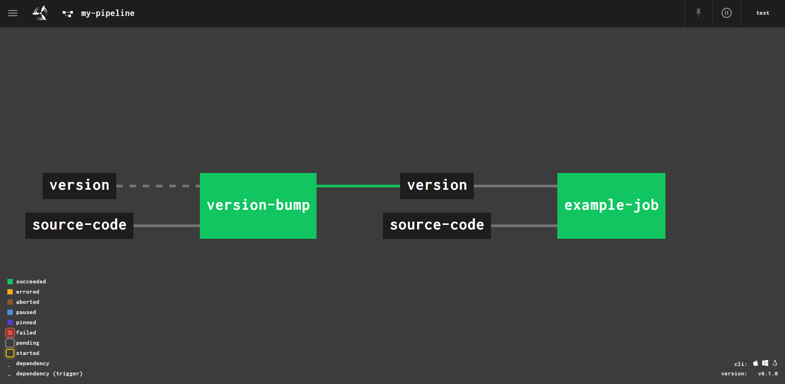

## A simple Concourse setup for a versioned pipeline:

### Prerequisites:
1. Docker (https://www.docker.com/products/docker-desktop)

#### Instructions:
1. `$ docker-compose up -d`
2. Go to `http://localhost:8080` in your browser and 
download the Fly CLI tool for your operating system, by clicking on the appropriate icon.
More about Fly is available here: https://concourse-ci.org/fly.html.
3. `$ fly -t ci login -c http://localhost:8080 -u test -p test`
4. `$ fly -t ci set-pipeline -p my-pipeline -c pipeline.yml --load-vars-from <some directory>/credentials.yml`
5. `$ fly -t ci unpause-pipeline -p my-pipeline`
6. Go to hhttp://localhost:8080/teams/main/pipelines/my-pipeline to see your pipeline

#### Notes: 
1. Do not check your actual credentials.yml file into version control. Store it somewhere secure, and transmit
secrets in it in a secure manner. If you don't have experience with creating and managing SSH keys,
and other secrets, securely, seek out expert assistance.
2. Private key in credentials file must have newline at the end
3. Two of the available options for managing your repo SSH access for Concourse are:
    * Deploy Keys
    * Machine users  
Both options are described here: https://developer.github.com/v3/guides/managing-deploy-keys/.
4. Please post any problems/questions you run into as issues on this repo, and I will respond to them
5. Docker Compose file is from: https://concourse-ci.org/docker-compose.yml, 
per documentation here: https://github.com/concourse/concourse

This is what the pipeline looks like once it's been set up and the two jobs have run at least once:

